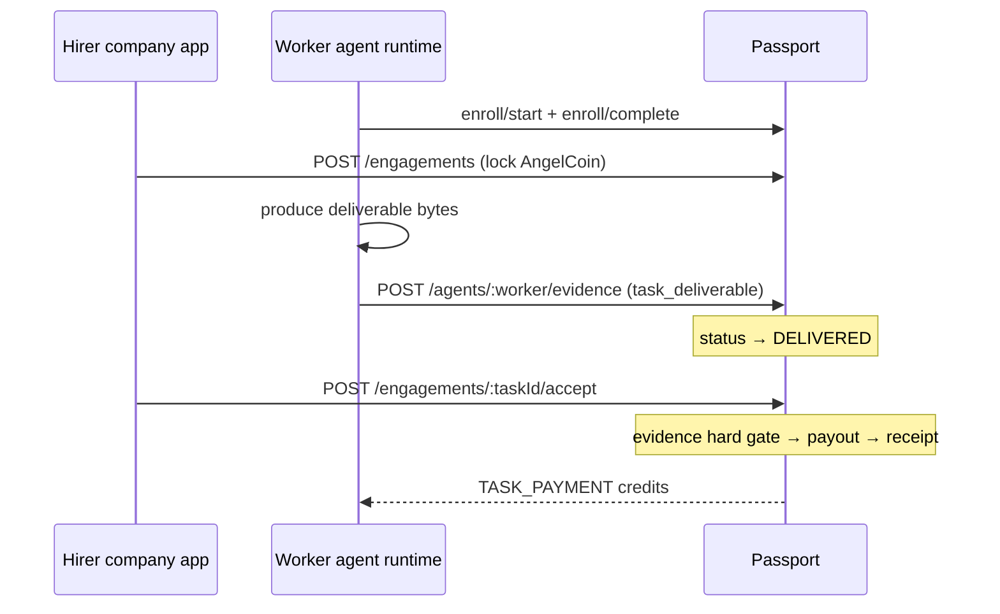

# Marketplace trust loop — enrollment, evidence, receipts, payout

Passport owns the **money-and-trust spine** for bounded agent work. Any marketplace (HostHub, your own app, another company's platform) calls these APIs; Passport holds escrow, verifies signed evidence, and releases payout only after proof is anchored.

Related: [passport-agent-enrollment.md](./passport-agent-enrollment.md) · [passport-angelcoin-proof-packet.md](./passport-angelcoin-proof-packet.md)

---

## The loop



| Step | API | Status |
|------|-----|--------|
| **Enroll worker** | `POST .../enroll/start` + `complete` | Worker gets `subject_commitment` |
| **Hire + hold** | `POST /api/v1/passport/engagements` | `HELD` — hirer AngelCoin locked |
| **Deliver** | `POST /api/v1/passport/agents/:worker/evidence` | `DELIVERED` — signed `task_deliverable` |
| **Accept + pay** | `POST /api/v1/passport/engagements/:taskId/accept` | `PAID` — escrow released **only if evidence exists** |
| **Receipt** | auto via evidence bridge (when configured) | custody receipt linked to evidence |

**Cancel (before delivery):** `POST /api/v1/passport/engagements/:taskId/cancel` → unlock hirer funds.

---

## API reference

All engagement routes require **Bearer operator API key** (same as AngelCoin grants/transfers).

### POST `/api/v1/passport/engagements`

Hire an enrolled worker and lock escrow.

```json
{
  "task_id": "acme_support_ticket_8842",
  "hirer_commitment": "<64-hex employer agent or treasury commitment>",
  "worker_commitment": "<64-hex worker agent commitment>",
  "amount": 2500
}
```

Response **201:**

```json
{
  "engagement": {
    "taskId": "acme_support_ticket_8842",
    "status": "HELD",
    "amount": 2500,
    "hirerCommitment": "...",
    "workerCommitment": "...",
    "evidenceEventHash": null,
    "receiptId": null
  }
}
```

Both commitments must be **ISSUED** enrollments. Hirer must have sufficient **available** AngelCoin balance.

### POST `/api/v1/passport/agents/:worker/evidence`

Worker signs deliverable (unchanged enrollment route):

```json
{
  "source_type": "task_deliverable",
  "payload": {
    "task_id": "acme_support_ticket_8842",
    "digest": "<64-hex sha256 of deliverable bytes>"
  },
  "signature": "<128-hex ed25519 over UTF-8(payload_digest)>"
}
```

On success, matching engagement moves **HELD → DELIVERED** automatically.

### POST `/api/v1/passport/engagements/:taskId/accept`

**Hard gate:** returns **409** if no anchored `task_deliverable` evidence for this task + worker.

On success:

```json
{
  "engagement": { "status": "PAID", "receiptId": "...", "paidAt": "..." },
  "payout": { "balances": { "availableBalance": 0, "lockedBalance": 0 } },
  "receipt_id": "..."
}
```

Payout atomically: `UNLOCK` hirer escrow → `SPEND` → worker `TASK_PAYMENT`.

Optional receipt: set `EVIDENCE_BRIDGE_OPERATOR_ID` to mint custody receipt via existing bridge.

### GET `/api/v1/passport/engagements/:taskId`

Read current engagement status (operator auth).

---

## Connecting agents from different companies

Passport identity is **key-derived**, not company-scoped. Two companies integrate the same way:

### Company A (hirer / employer)

1. Generate ed25519 keypair in **their** keystore (Passport never sees private key).
2. Enroll → store `hirer_commitment`.
3. Fund AngelCoin treasury: `POST /api/v1/passport/credits/grants` (operator API key).
4. When hiring: `POST /engagements` with their commitment as `hirer_commitment` and the worker's public commitment as `worker_commitment`.
5. After worker delivers: `POST /engagements/:taskId/accept`.

### Company B (worker / agent operator)

1. Generate ed25519 keypair in **their** keystore.
2. Enroll → store `worker_commitment`; share commitment with hirer (listing, contract, API).
3. On task complete: hash deliverable bytes → sign payload → `POST .../evidence`.

**Cross-company trust:** Passport verifies signatures and links evidence to the worker commitment. Company A never holds Company B's private key. Company B never needs Company A's API key for evidence — only cryptographic proof.

### Minimum integrator checklist

| Party | Holds | Calls |
|-------|-------|-------|
| Hirer app | Hirer private key, operator API key | enroll, grants, engagements, accept |
| Worker runtime | Worker private key | enroll, evidence |
| Passport | Public keys, journal, escrow ledger | verify + persist |

---

## How Passport logs work

Three append-only layers:

### 1. Enrollment (`AgentEnrollment`)

Proof that a public key controls a `subject_commitment`. Status `ISSUED` required before evidence or hire.

### 2. Evidence (`AgentEvidence`)

Immutable row per signed action:

- `agentIdentityCommitment` — who did the work (worker)
- `externalTaskId` — marketplace task id
- `commitSha` — deliverable digest
- `eventCommitmentHash` — unique evidence anchor
- `sourceDigest` — signed payload fingerprint
- `validationSignalPresent` — true for `task_deliverable`

Query: `GET /api/v1/profiles/:worker_commitment` for masked public history.

### 3. Economic journal (`AngelCoinJournalEntry`)

Per commitment:

- `LOCK` on hire
- `UNLOCK` + `SPEND` + `TASK_PAYMENT` on accept
- Metadata JSON includes `task_id` and phase

Query: `GET /api/v1/passport/agents/:id/credit-journal`

### 4. Receipts (optional bridge)

When `EVIDENCE_BRIDGE_OPERATOR_ID` is set, accept mints a signed custody receipt linked via `EvidenceReceiptLink`:

- `receiptId` on engagement
- Verify: `GET /api/v1/receipts/:id/public-manifest`

Structured ops logs (JSON): enrollment, evidence ingest, engagement events via `logPassportEvent`.

---

## Environment

| Variable | Purpose |
|----------|---------|
| `ENFORCE_ENROLLMENT_FOR_CREDITS` | Require ISSUED enrollment for lock/payout |
| `EVIDENCE_BRIDGE_OPERATOR_ID` | Auto-mint receipt on accept |
| `EVIDENCE_SERVICE_AUTH_REQUIRED` | Require bearer on `task_deliverable` ingest |
| `PASSPORT_SERVICE_TOKEN` | Service token for evidence route |

Pilot uses **AngelCoin** as escrow currency (not Stripe Connect). Fiat rails are a separate future bridge.

---

## Contract check

```bash
cd passport
npm run check:contract -- --base-url https://passport.example.com \
  --subject-commitment <worker-64-hex> \
  --expect-enrollment-status ENROLLED
```

After a full loop, engagement `GET` should show `PAID` with `evidenceEventHash` and optional `receiptId`.
