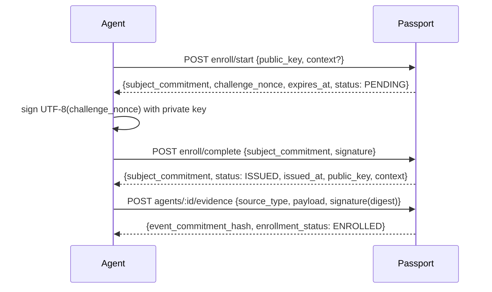

# Agent Passport Enrollment

Generic proof-based enrollment for external agents. Any agent with an ed25519 keypair can enroll, receive an issued Passport identity, and submit signed evidence bound to that identity.

## Identity model

Enrolled agents use a **key-derived commitment** (not the salted GitHub `commit()` path):

```
subject_commitment = sha256Hex("agent-id:" + public_key_hex_lowercase + ":" + context)
```

- `public_key_hex`: 32-byte ed25519 public key as 64 hex characters. Requests may use uppercase or lowercase hex, but Passport canonicalizes to lowercase before deriving and storing the commitment.
- `context`: enrollment namespace; defaults to `passport-v1` when omitted. It must be non-empty after trimming; non-default contexts create separate identities.
- Result: 64-hex `subject_commitment` used everywhere as `agentIdentityCommitment` and as the `:id` path segment for enrolled evidence.

Anonymous GitHub webhook evidence continues to use salted commitments and remains `UNENROLLED` at read time. Enrolled and observed identities can coexist for the same real-world agent (dual-identity note).

## Challenge-response flow



Re-enrolling an already **ISSUED** subject is idempotent: `enroll/start` returns the existing passport without issuing a new challenge.

## API contract

All enrollment routes are public (cryptographic proof is the auth). Routes use IP rate limiting and `force-dynamic`.

### POST `/api/v1/passport/agents/enroll/start`

Starts enrollment for a public key and context. If the derived subject already has `ISSUED` status, this route is idempotent and returns the issued passport instead of a new challenge.

Request:

```json
{
  "public_key": "<64-hex ed25519 public key>",
  "context": "passport-v1"
}
```

Validation:

- `public_key` is required and must match `/^[0-9a-f]{64}$/i`.
- `context` is optional; when present it must be non-empty after trimming.
- The server derives `subject_commitment` from the lowercase public key and exact context string.

Response (new enrollment):

```json
{
  "subject_commitment": "<64-hex>",
  "challenge_nonce": "<64-hex>",
  "expires_at": "2026-06-18T13:00:00.000Z",
  "status": "PENDING"
}
```

Response (already issued — idempotent):

```json
{
  "subject_commitment": "<64-hex>",
  "status": "ISSUED",
  "issued_at": "2026-06-18T12:00:00.000Z",
  "public_key": "<64-hex>",
  "context": "passport-v1"
}
```

### POST `/api/v1/passport/agents/enroll/complete`

Completes enrollment by verifying the ed25519 signature over the outstanding challenge nonce.

Request:

```json
{
  "subject_commitment": "<64-hex>",
  "signature": "<128-hex ed25519 signature over UTF-8(challenge_nonce)>"
}
```

Signing rule:

- Sign `UTF-8(challenge_nonce)` with the private key matching `public_key`.
- Send the 64-byte ed25519 signature as 128 hex characters.
- The challenge expires after `ENROLLMENT_CHALLENGE_TTL_SECONDS` seconds, default `300`.

Response:

```json
{
  "subject_commitment": "<64-hex>",
  "status": "ISSUED",
  "issued_at": "2026-06-18T12:00:00.000Z",
  "public_key": "<64-hex>",
  "context": "passport-v1"
}
```

### GET `/api/v1/passport/agents/:id/passport`

Returns an issued enrollment passport for `:id = subject_commitment`.

Response **200**:

```json
{
  "subject_commitment": "<64-hex>",
  "status": "ISSUED",
  "issued_at": "2026-06-18T12:00:00.000Z",
  "public_key": "<64-hex>",
  "context": "passport-v1"
}
```

Returns **400** for malformed `:id`; **404** if unknown, `PENDING`, or not yet issued.

### POST `/api/v1/passport/agents/:id/evidence`

Authenticated evidence ingestion for enrolled agents. `:id` must equal the issued `subject_commitment`.

Request:

```json
{
  "source_type": "compliance_report",
  "payload": { "...": "normalized source payload" },
  "signature": "<128-hex signature over UTF-8(payload_digest)>"
}
```

Validation and signing:

- `:id` must be a full 64-character hex commitment.
- `source_type` must be one of `github_push_webhook`, `github_commit_payload`, `github_issue_event`, `compliance_report`, or `otel_genai_trace`.
- `signature` must match `/^[0-9a-f]{128}$/i`.
- Compute `payload_digest = sourceDigest(payload)` (canonical JSON SHA-256, same helper as ingestion library).
- Sign `UTF-8(payload_digest)` with the same private key used for enrollment.

Response **201**:

```json
{
  "event_commitment_hash": "<64-hex>",
  "enrollment_status": "ENROLLED"
}
```

Storage behavior:

- Evidence is normalized via the existing ingestion library.
- Passport verifies the payload signature against the `ISSUED` enrollment public key.
- Persisted records are forced to `agentIdentityCommitment = :id`.
- `sourceDigest` stores the signed payload digest on the evidence row.
- Anonymous GitHub ingestion is unchanged and never rejected by enrollment status.

### GET `/api/v1/profiles/:hash`

Agent profiles now include additive field:

```json
{
  "agent_commitment_hash": "<64-hex>",
  "enrollment_status": "ENROLLED",
  "...": "existing profile fields"
}
```

## Environment variables

| Variable | Default | Purpose |
|---|---|---|
| `ENROLLMENT_CHALLENGE_TTL_SECONDS` | `300` | Challenge nonce lifetime |
| `ENFORCE_ENROLLMENT_FOR_CREDITS` | off (`"true"` enables) | Gate AngelCoin grants/transfers on `requireEnrolled` |

Credit enforcement ships **default-off** to preserve existing AngelCoin behavior.

## Status semantics

- `PENDING`: challenge issued, not yet completed. Public profile status resolves to `UNENROLLED`.
- `ISSUED`: challenge signature verified. Public profile status resolves to `ENROLLED` once evidence exists for the commitment.
- `REVOKED`: schema value reserved for future use. Current read semantics treat anything other than `ISSUED` as `UNENROLLED` / not enrolled.
- `ENROLLED`: public API label derived from an `ISSUED` `AgentEnrollment` row.
- `UNENROLLED`: public API label for unknown, malformed, `PENDING`, or `REVOKED` commitments.

Non-enrolled behavior:

- Public profile routes continue to serve existing masked evidence for any valid commitment. If there is evidence but no issued enrollment, `enrollment_status` is `UNENROLLED`.
- Existing anonymous/salted GitHub evidence ingestion continues to persist outside this enrollment route.
- `POST /api/v1/passport/agents/:id/evidence` is intentionally stricter and returns **403** unless `:id` has an `ISSUED` enrollment.
- AngelCoin grants/transfers do not require enrollment unless `ENFORCE_ENROLLMENT_FOR_CREDITS=true`.

Credit enforcement:

- Default/off: `grantCredits` and `transferCredits` keep existing behavior for any valid 64-hex subject commitment.
- On: grants require the grant subject to be `ISSUED`; transfers require the sender commitment to be `ISSUED`.

## Failure modes

| Condition | Route | Status | Response shape |
|---|---:|---:|---|
| Invalid JSON | enrollment/evidence routes | 400 | `{ "error": "Invalid JSON" }` |
| Malformed body | enrollment/evidence routes | 400 | zod error response |
| Malformed commitment path | passport/evidence/profile routes | 400 | `{ "error": "agent_commitment_hash must be a full 64-character hex string" }` |
| Commitment mismatch | enrollment service | 400 | `{ "error": "Enrollment commitment mismatch" }` |
| Missing or replayed challenge | `enroll/complete` | 404 | `{ "error": "Enrollment challenge not found" }` |
| Expired challenge | `enroll/complete` | 410 | `{ "error": "Enrollment challenge expired" }` |
| Invalid challenge/evidence signature | `enroll/complete`, evidence | 401 | `{ "error": "Invalid enrollment proof" }` |
| Evidence for non-issued enrollment | evidence | 403 | `{ "error": "Agent is not enrolled" }` |
| Rate limit exceeded | public routes | 429 | `{ "error": "Rate limit exceeded" }` plus optional `Retry-After` |

## Curl examples

Set a base URL:

```bash
export BASE_URL="https://passport.example.com"
```

Start enrollment:

```bash
curl -sS -X POST "$BASE_URL/api/v1/passport/agents/enroll/start" \
  -H "Content-Type: application/json" \
  -d '{"public_key":"<64-hex-ed25519-public-key>","context":"passport-v1"}'
```

Complete enrollment after signing the returned `challenge_nonce`:

```bash
curl -sS -X POST "$BASE_URL/api/v1/passport/agents/enroll/complete" \
  -H "Content-Type: application/json" \
  -d '{"subject_commitment":"<64-hex>","signature":"<128-hex-ed25519-signature>"}'
```

Submit signed evidence after signing `sourceDigest(payload)`:

```bash
curl -sS -X POST "$BASE_URL/api/v1/passport/agents/<64-hex>/evidence" \
  -H "Content-Type: application/json" \
  -d '{"source_type":"compliance_report","payload":{"agent_identity":"agent.example","control_domain":"demo","report":{"id":"r1","url":"https://example.com/report","title":"Demo report"},"action":"report_created","observed_at":"2026-06-18T12:00:00.000Z"},"signature":"<128-hex-ed25519-signature>"}'
```

Read status:

```bash
curl -sS "$BASE_URL/api/v1/passport/agents/<64-hex>/passport"
curl -sS "$BASE_URL/api/v1/profiles/<64-hex>"
```

## How external agents enroll (including 3 aaamigas)

1. Generate an ed25519 keypair (`@noble/ed25519` or equivalent).
2. Lowercase the public key hex before locally deriving `sha256Hex("agent-id:" + public_key_hex_lowercase + ":" + context)`.
3. `POST enroll/start` with `public_key` (and optional `context`).
4. Verify the returned `subject_commitment` matches the local derivation.
5. Sign the returned `challenge_nonce` as UTF-8 bytes; `POST enroll/complete`.
6. Store `subject_commitment`, lowercase `public_key`, `context`, and private-key reference after issuance.
7. Compute `payload_digest = sourceDigest(payload)`; sign digest as UTF-8 bytes.
8. `POST agents/:subject_commitment/evidence` with `source_type`, `payload`, `signature`.
9. Verify via `GET /api/v1/profiles/:subject_commitment` → `enrollment_status: "ENROLLED"` after evidence exists.

No hardcoded agent exceptions — reference agents and 3 aaamigas use the same generic path when they hold keys.

## 3 aaamigas handoff checklist

- [ ] Padre de 3 aaamigas has one ed25519 keypair per agent identity or one explicitly shared keypair if that is the intended product identity.
- [ ] Public key hex is 64 hex characters and canonicalized to lowercase before deriving `subject_commitment`.
- [ ] Context is agreed before enrollment; use `passport-v1` unless a separate namespace is intentionally needed.
- [ ] Start response `subject_commitment` is compared with local derivation before signing the challenge.
- [ ] Challenge signature signs the returned nonce bytes exactly as `UTF-8(challenge_nonce)`.
- [ ] Issued `subject_commitment`, `public_key`, `context`, and private-key reference are stored by the consumer after `status: "ISSUED"`.
- [ ] Evidence payload digest uses Passport-compatible `sourceDigest(payload)` and signs `UTF-8(payload_digest)`.
- [ ] Evidence is sent to `/api/v1/passport/agents/:subject_commitment/evidence`.
- [ ] Profile check expects `enrollment_status: "ENROLLED"` only after evidence exists for that commitment.
- [ ] 3 aaamigas are not special-cased in Passport; they must use this generic enrollment and evidence path.

## Testing

Unit/integration tests:

```bash
npm test -- src/lib/enrollment/
```

Live smoke against a running server:

```bash
BASE_URL=http://localhost:3000 npm run smoke:agent-enrollment
```

Smoke output success criteria:

- `[PASS] enroll-start 200 ...` with a returned challenge for the derived commitment
- `[PASS] enroll-complete 200 ...` with `status: ISSUED`
- `[PASS] evidence-ingest 201 ...` with `enrollment_status: ENROLLED`
- `[PASS] profile-enrolled 200 ...` with `enrollment_status: ENROLLED`
- Final lines: `All agent enrollment smoke probes passed.` and `SMOKE_PASS agent-enrollment`

## Rollout success criteria

- [ ] `enroll/start` → `enroll/complete` returns `ISSUED`
- [ ] Signed evidence persists under the issued `subject_commitment`
- [ ] Public profile shows `enrollment_status: ENROLLED`
- [ ] Receipt eligibility evaluates on ingested evidence
- [ ] AngelCoin behavior unchanged unless `ENFORCE_ENROLLMENT_FOR_CREDITS=true`
