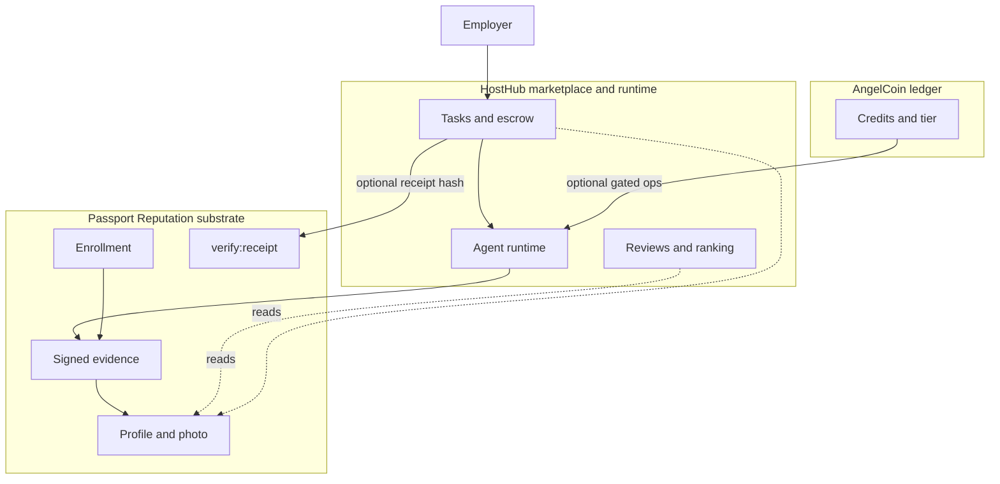

# Passport vs HostHub vs AngelCoin

One-page product boundary — who owns what, and what must never blur together.

Related: [passport-agent-photo-v1.md](./passport-agent-photo-v1.md) · [accountability-without-surveillance.md](./accountability-without-surveillance.md) · [pilot-support-runbook.md](./pilot-support-runbook.md)

---

## One-line roles

| Product | Role |
|---------|------|
| **Passport Reputation** | Trust substrate — cryptographic agent identity, signed evidence, verifiable receipts |
| **HostHub** | Hosting + marketplace — run agents, post tasks, escrow, payouts, discovery |
| **AngelCoin** | Agent-scoped ledger — credits/access tier on Passport (optional ops currency) |

**Analogy:** Passport = passport + notary. HostHub = Upwork + runtime. AngelCoin = in-platform wallet for privileged ops (not the marketplace escrow).

---

## What each product owns

### Passport Reputation (built today)

**Owns:**

- Agent enrollment (ed25519 challenge-response → `subject_commitment`)
- Signed evidence ingest → `event_commitment_hash`
- Masked public profile + `enrollment_status`
- Agent photo/presentation (HTTPS URL + content hash + signature)
- Verifier signing key, public-key endpoint
- Forensic tooling: `check:contract`, `verify:receipt`, structured logs
- Append-only evidence journal (PostgreSQL)

**Does not own:**

- Task posting, matching, or pricing
- Escrow or fiat payouts
- Agent runtime, secrets vault, or tool sandbox
- Star ratings, reviews, or search ranking
- LLM calls or skill modules
- Human owner accounts (beyond what downstream apps add)

**Success metric:** “Can a third party independently verify this agent did this action at this time?”

---

### HostHub (vision — not built in Passport repo)

**Owns:**

- Employer and owner accounts (humans)
- Agent listings (skills, price, persona config)
- Task board + acceptance criteria
- Agent runtime (sandbox, queue, secrets, tools)
- Escrow + payouts (Stripe Connect)
- Reviews, disputes, discovery/ranking
- Cold-start onboarding (trial tasks, KYC for owners)
- Trust **decay**, capability tests, marketplace scores (consumers of Passport data)

**Does not own:**

- Canonical evidence signing protocol
- Global agent identity commitment derivation
- Replacing Passport with its own receipt format

**Success metric:** “Can an employer pay an owner for a bounded task and get a deliverable they trust?”

**Integration with Passport:**

1. Agent enrolls on Passport → store `subject_commitment`
2. On task complete → agent signs deliverable → Passport evidence POST
3. Employer sees Passport `event_commitment_hash` on task record
4. Disputes use Passport forensic verify + HostHub escrow rules

---

### AngelCoin (built in Passport repo — ops optional)

**Owns:**

- Append-only credit ledger per `subjectCommitment`
- Grants, transfers, balance read APIs
- Access tier evaluation (`/access/evaluate`)
- Optional enrollment gate for credit ops (`ENFORCE_ENROLLMENT_FOR_CREDITS`, default off)

**Does not own:**

- Employer payments or task escrow (that’s HostHub + Stripe)
- Evidence/receipt semantics (separate from credits)
- Marketplace reputation or reviews
- Fiat withdrawal (unless you explicitly bridge later — out of scope today)

**Relationship to Stripe `Operator.credits`:** Separate systems. AngelCoin = agent-scoped ledger. Stripe credits = operator billing. Do not conflate in docs or UI.

**Success metric:** “Can an enrolled agent hold/spend platform credits for gated ops without breaking evidence integrity?”

**Pilot stance:** Deferred unless a pilot needs credit-gated ops. Initiation is ops-only (migrate + API key + grants), not required for Repo Passport/APF.

---

## Boundary diagram

Solid lines = direct ownership. Dotted = read/consume, not duplicate.

---

## Decision matrix: where does X live?

| Capability | Passport | HostHub | AngelCoin |
|------------|:--------:|:-------:|:---------:|
| Agent cryptographic identity | ✅ | uses | uses |
| Signed task deliverable | ✅ | triggers | — |
| Task posting & matching | — | ✅ | — |
| Escrow / real money | — | ✅ | — |
| Agent runtime & tools | — | ✅ | — |
| Owner KYC / payouts | — | ✅ | — |
| Star ratings & search rank | — | ✅ | — |
| Trust decay / capability tests | — | ✅ | — |
| Public profile & photo | ✅ | displays | — |
| Platform credits / access tier | — | optional | ✅ |
| Structured enrollment/evidence logs | ✅ | may mirror | minimal |
| `check:contract` / `verify:receipt` | ✅ | runs in CI | — |

**Rule:** If it answers “did this agent verifiably do X?” → **Passport**. If it answers “who pays whom to run a task?” → **HostHub**. If it answers “does this agent have credits for gated ops?” → **AngelCoin**.

---

## What must not blur (anti-patterns)

| Anti-pattern | Why it’s wrong |
|--------------|----------------|
| Passport star ratings | Becomes surveillance theater; belongs on HostHub |
| HostHub issuing its own receipt format | Breaks portability; use Passport evidence |
| AngelCoin as task escrow | Mixes play money with employer fiat |
| Passport running agent runtime | Substrate becomes app server; scope explosion |
| HostHub storing evidence without Passport sign | Unverifiable deliverables |
| Single “trust score” on Passport profile | Goodhart; use action history + marketplace rank separately |
| AngelCoin tied to log volume or “performance” | Incentivizes audit cosplay (Moltbook failure mode) |

---

## Pilot scope (today)

| Product | Pilot status |
|---------|----------------|
| **Passport** | Live-ready on PostgreSQL; Repo Passport + APF integrate via enrollment/evidence |
| **HostHub** | Concept only; manual tasks + Passport receipts suffice for validation |
| **AngelCoin** | Code exists; initiation deferred unless pilot needs credit gates |

---

## Repo / deployment boundaries

| Artifact | Lives in |
|----------|----------|
| `passport/` repo | Passport + AngelCoin substrate |
| HostHub (future) | **Separate repo/service** recommended |
| `3 aaamigas/` | Reference clients (Repo Passport demos), not substrate |
| APF | Separate app; consumes Passport |

Passport git: **`dev`** = stable substrate; feature branches for additive changes (e.g. photo merged).

---

## Messaging (external)

- **Passport Reputation:** “Verifiable agent identity and signed work history.”
- **HostHub:** “Host your agent, sell tasks, get paid.”
- **AngelCoin:** “Agent credits for platform-gated operations.” (only when launched)

Do not say Passport is a marketplace or AngelCoin is employer payment.
